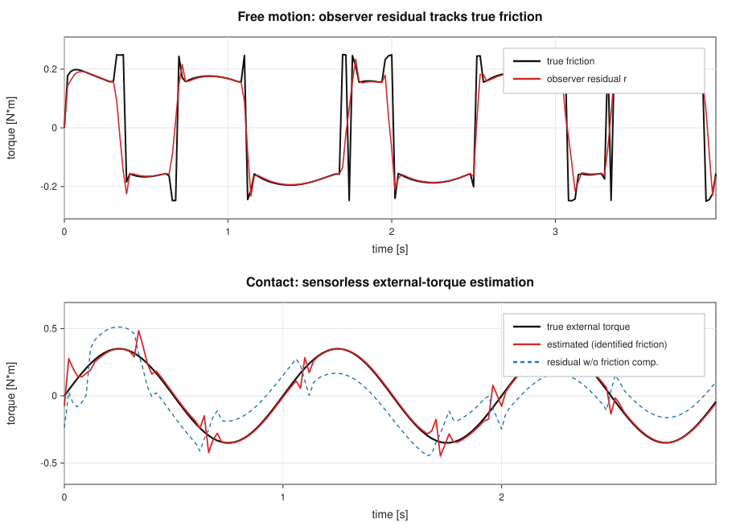
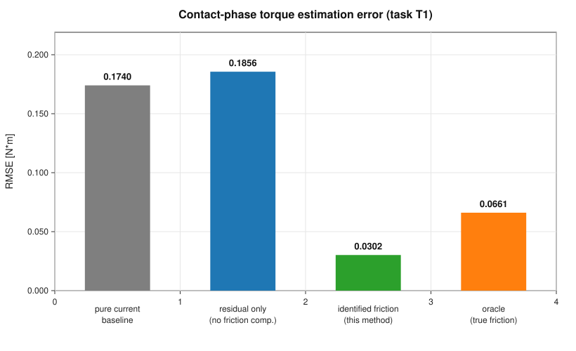
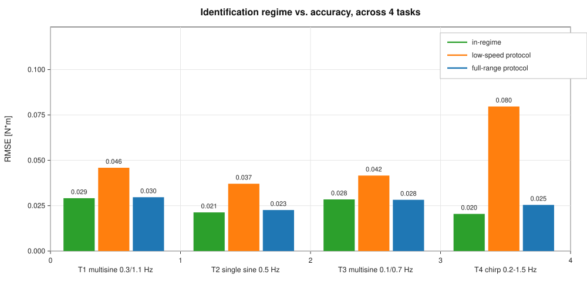
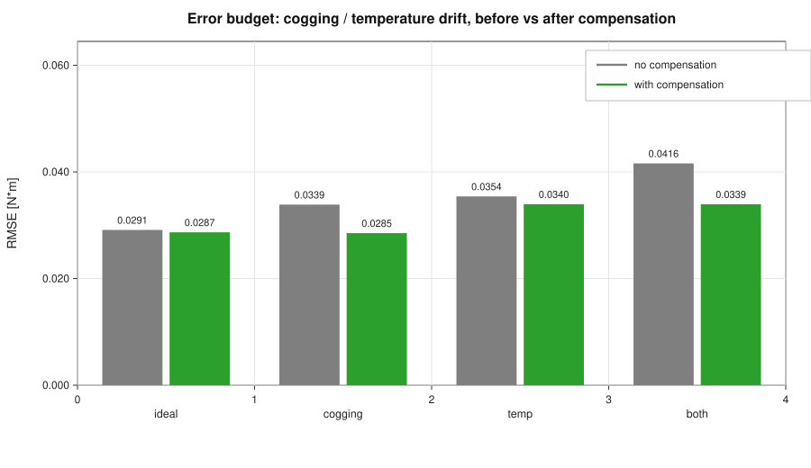

# Sensorless Torque Estimation for Low-Cost QDD Robot Joints

面向低成本准直驱（QDD）机器人关节的**无力矩传感器力矩估计**，
带**自由运动段自监督摩擦辨识**。

> 状态：**已实测运行通过**（`src/simulate_stdlib.py`，零第三方依赖）。
> 详细研究结论、踩过的坑、被推翻的假设 → 见 **`FINDINGS.md`**。

## 实测结果（已验证）

| 方法 | 接触段力矩估计 RMSE |
|---|---|
| 纯电流开环 `τ = K_t·i_q` | 0.174 N·m |
| 观测器残差直接用（不扣摩擦） | 0.186 N·m |
| **观测器 + 摩擦补偿（本方法）** | **0.030 N·m** |
| 用**真实**摩擦模型补偿 | 0.066 N·m |

**相对基线改善 82.6%。** 稳态下观测器残差与真实摩擦力吻合到 1% 以内。

## 图

| | |
|---|---|
|  |  |
| **Fig 1** 自由段残差跟踪真实摩擦；接触段无力矩传感器力矩估计 | **Fig 2** 四种估计方式的精度对比 |
|  |  |
| **Fig 3** 4 个任务 × 3 种辨识工况 | **Fig 4** 误差预算：齿槽与温漂，补偿前后 |

图由 `src/make_figures.py` **零依赖**生成（纯标准库直接输出 SVG）。

## 已知结论与未解问题

**已确认**
- 无力矩传感器的力矩估计框架有效（改善 83–96%，4 个任务验证）
- Stribeck 参数**结构性不可辨识**，但**曲线误差仅 ≈0.010 N·m，退化对下游无害**
- 误差预算：齿槽转矩（0.017）与温漂（0.020）是两个主要残余误差源，**都能补偿**
- 「完美摩擦悖论」：代入真实摩擦模型反而更差（4/4 任务成立）

**未解 / 待查**
- 极端低噪声（1e-5）时精度反而下降，原因未明
- 温漂只能部分补偿（保持常数而 δ 仍在上升）
- **所有结果均为仿真，尚无硬件验证** ← 最大的缺口

详见 `FINDINGS.md`。

---

## 为什么做这个

具身智能/模仿学习类方法（如 FMimic, IJRR 2025）的规划层已经很强，
但其论文明确指出执行 **physical interaction** 时仍依赖预定义动作基元，
*"which remains a major bottleneck for robotic systems"*。

这个瓶颈的物理底座是执行器：**机器人手上的力不可信，接触阶段就无法闭环。**

本项目的目标：**在只有相电流与编码器、没有关节力矩传感器的条件下，
给出可信的关节力矩估计**，从而支撑力控、阻抗控制与模仿学习的数据质量。

## 核心思路

广义动量观测器的残差 `r` 在两种工况下含义不同：

| 工况 | 残差含义 | 用途 |
|---|---|---|
| **自由运动**（无外部接触） | `r → 摩擦力 τ_f` | **自监督辨识摩擦参数** |
| **接触**（有外部力矩） | `r → τ_f + τ_ext` | `τ̂_ext = r − τ̂_f` |

**关键点：不需要专门的辨识实验。** 机器人在正常运动时，自由段天然提供了摩擦辨识的监督信号。
在低成本场景下「省掉一次专门标定」正是最有价值的部分。

## 快速开始

```bash
pip install -r requirements.txt
python src/simulate.py
```

输出到 `docs/figures/`：四张图 + `metrics.txt`（含相对基线的改善幅度）。

## 目录结构

```
src/
  joint_model.py        单关节机电耦合模型（dq简化 + Stribeck摩擦）—— "真实系统"
  momentum_observer.py  广义动量观测器 —— 残差 r 的估计
  friction_rls.py       RLS 在线摩擦辨识 + v_s 网格搜索
  simulate.py           仿真主程序：自由段辨识 → 接触段力矩估计
docs/figures/           生成的图与指标
```

## 算法要点

**观测器**（离散，稳定性条件 `0 < K_O·Ts < 2`）

```
r_{k+1} = r_k + K_O·Ts·( τ_m,k − (p_{k+1}−p_k)/Ts − r_k ),   p = J·qd
```

**摩擦线性参数化**（`v_s` 作固定超参数）

```
τ_f = θ₁·sgn(qd) + θ₂·exp(−|qd|/v_s)·sgn(qd) + θ₃·qd
θ = [τ_c, τ_s−τ_c, b]
```

**RLS 三个必要的工程保护**：速度死区、残差野值抑制、协方差阵对称化。
少了任何一个，参数都会在激励不足时漂移。

## 已实现的 vs 待做的

**已实现**
- [x] 单关节动力学 + Stribeck 摩擦模型
- [x] 广义动量观测器（含稳定性检查）
- [x] RLS 在线摩擦辨识 + `v_s` 离线网格搜索
- [x] 自由段/接触段自动切换的力矩估计
- [x] 测速噪声 + 低通滤波（模拟真实编码器差分）
- [x] 与「纯电流开环估计」基线的定量对比

**待做（Roadmap）**
- [ ] LuGre 模型对照实验（刻画预滑移）
- [ ] EKF 在线估计 `v_s`（当前固定）
- [ ] 温漂补偿：d轴电流注入在线辨识 `R_s` 与 `ψ_f`，修正 `K_t`
- [ ] 齿槽转矩建模与补偿
- [ ] 观测器增益 `K_O` 的带宽/噪声权衡扫频实验
- [ ] 双惯量 + 传动柔性（减速器场景）
- [ ] **接入真实台架数据**（最关键的一步）
- [ ] 阻抗控制 / 拖动示教应用验证

## 仿真场景

```
0 ~ 2.0 s   自由运动，多正弦轨迹激励 → RLS 在线辨识摩擦参数
2.0 ~ 4.0 s 施加已知外部力矩 → 验证无力矩传感器力矩估计
```

采用多正弦叠加而非单频正弦，是因为单一频率会导致回归向量病态、
部分参数不可辨识。这一点本身值得在论文中讨论。

## Roadmap（接入真实硬件）

1. 在现有电机+驱动器上读出 `i_q` 与编码器，替换 `simulate.py` 的数据源
2. **力矩标定**：砝码+杠杆臂做静态标定；已知惯量盘自由响应做动态标定
3. 跑「正弦扫频 / 阶跃 / 低速换向」三组工况 —— 低速换向是摩擦最恶劣、也是最有说服力的工况
4. 硬件设计文件（SolidWorks 装配体/工程图/BOM）将放在 `hardware/`（待补）

## 参考方向

检索关键词：momentum observer / sensorless torque estimation / friction identification /
LuGre / Stribeck / RLS / EKF / quasi-direct-drive actuator / proprioceptive actuator /
cogging torque compensation / impedance control

经典工作（**引用前请核对原文出处**）：De Luca & Mattone 的动量观测器系列、
Canudas de Wit 的 LuGre 模型、Armstrong-Hélouvry 的摩擦模型综述、
MIT Cheetah 系列的 proprioceptive actuator 设计。

## 许可

未定（建议 MIT 或 Apache-2.0，便于他人复现）。
